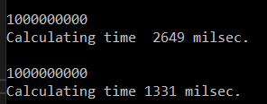

# Lab 5 

### OLD FILE

```
static void oldalg()
        {
            {
                int[,] AM = new int[2, 2];
                int res = 0;

                for (int j = 500000000; j > 0; j--)
                {
                    AM[0, 0]++;
                    AM[0, 0]++;
                }

                AM[1, 1] = AM[0, 0];

                Console.WriteLine(AM[0, 0]);

            }
        }
```

In this code, we create a 3X3 matrix and then enter a loop whose task each time to increase the value of the extreme upper left element of the matrix by 2.

### NEW FILE

```
static void newalg()
        {

            int[,] AM = new int[2, 2];
            // int res = 0;

            for (int j = 500000000; j > 0; j--)
            {
                AM[0, 0] += 2;
                // AM[0,0]++;
            }

            // AM[1,1] = AM[0,0];

            Console.WriteLine(AM[0, 0]);


        }
```
In the new code, we remove the unnecessary res variable, we also combine the increase by 2 into one row and remove the unnecessary filling of the central variable in the matrix.


### EXAMPLE




